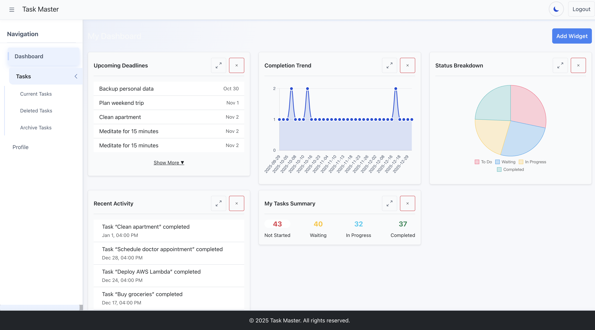
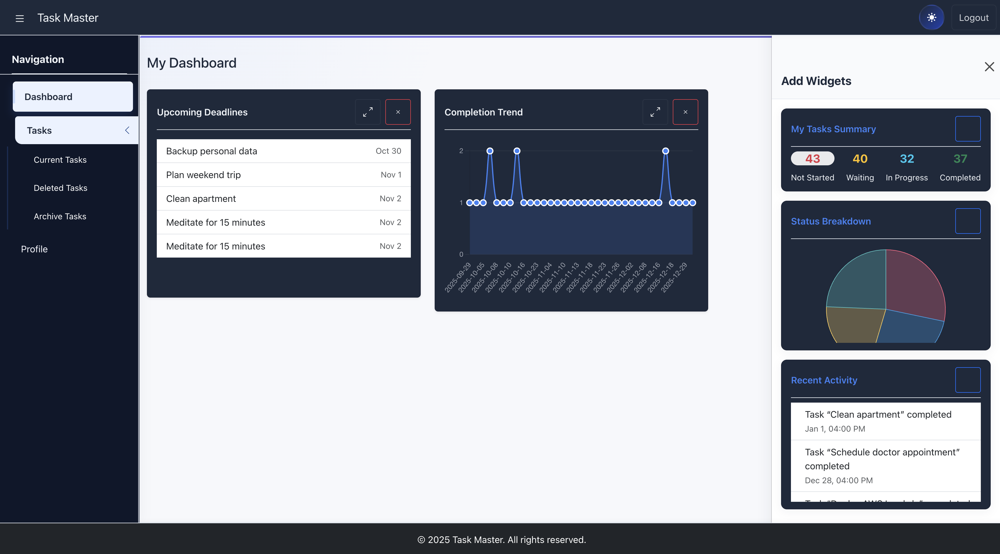
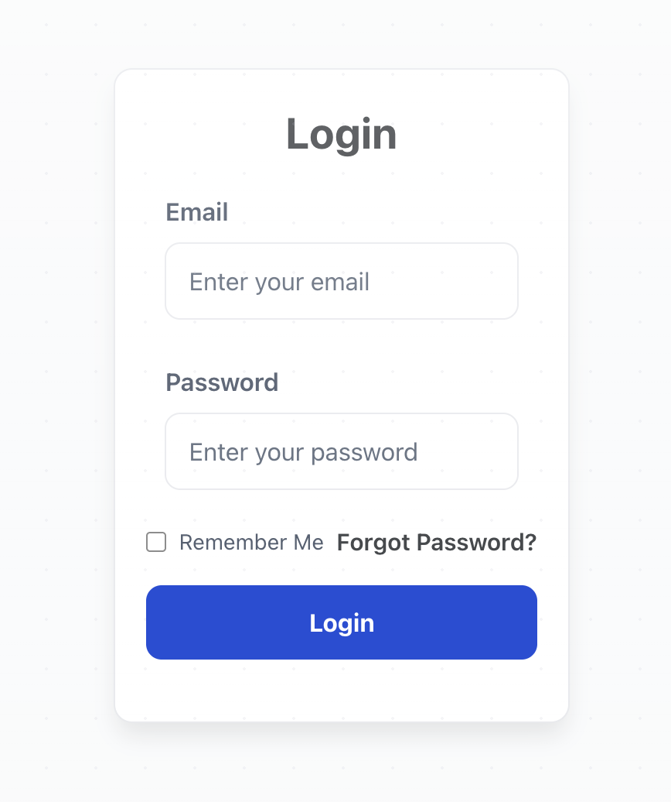
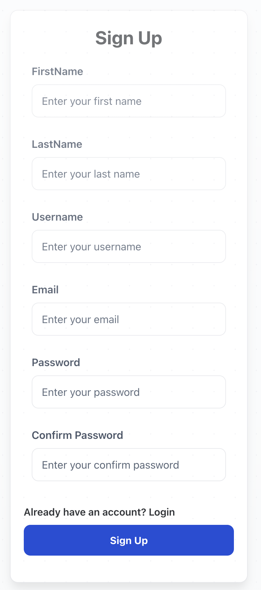
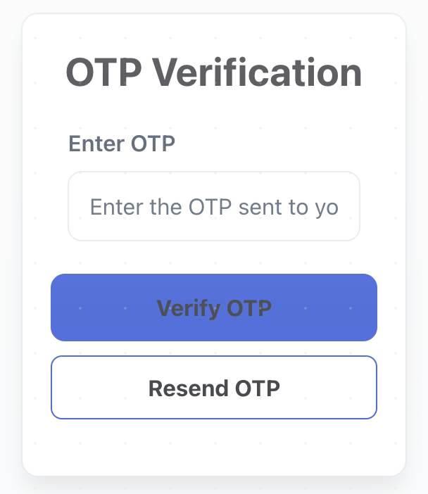
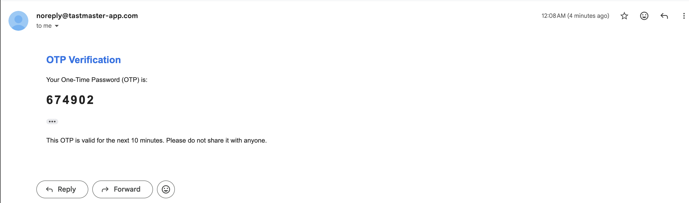
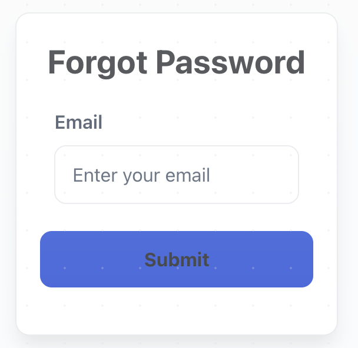

# TaskMaster App

<br />

<br />
A comprehensive task management application built with the MERN stack, featuring secure user authentication, task management, and productivity tracking.

## 🚀 Features

- **User Authentication & Security**
  - Secure user registration and login <br/>
  
  <br/>
  
  - JWT-based authentication
  - Password encryption with bcrypt
  - Email verification with OTP <br/>
   <br/>
  
  - Password reset functionality <br/>
  

- **Task Management**
  - Create, read, update, and delete tasks
  - Task categorization and prioritization
  - Task status tracking
  - Task history and analytics
  - Drag and drop task reordering

- **User Profile Management**
  - Profile creation and updates
  - Avatar upload with Cloudinary integration
  - User preferences and settings

- **Additional Features**
  - Email notifications with Nodemailer
  - Responsive design
  - RESTful API architecture
  - MongoDB database integration

## 🛠️ Tech Stack

### Backend
- **Node.js** - Runtime environment
- **Express.js** - Web framework
- **MongoDB** - Database
- **Mongoose** - ODM for MongoDB
- **JWT** - Authentication
- **bcrypt** - Password hashing
- **Nodemailer** - Email service
- **Cloudinary** - Image storage
- **Multer** - File upload handling

### Frontend
- **React 19** - Frontend framework
- **Vite** - Build tool and development server
- **React Router DOM** - Client-side routing
- **Bootstrap & React Bootstrap** - UI components and styling
- **Chart.js & React Chart.js 2** - Data visualization
- **@dnd-kit** - Drag and drop functionality
- **Axios** - HTTP client for API calls
- **React Google reCAPTCHA** - Security integration

## 📁 Project Structure

```
taskmaster-app/
├── backend/                 # Backend application
│   ├── config/             # Database configuration
│   ├── controller/         # Route controllers
│   │   ├── Tasks/         # Task-related controllers
│   │   ├── userController.js
│   │   └── userProfileController.js
│   ├── middleware/         # Custom middleware
│   │   ├── Tasks/         # Task validation middleware
│   │   ├── authMiddleware.js
│   │   └── validateUserProfile.js
│   ├── model/             # Database models
│   │   ├── Task/          # Task model
│   │   ├── User.js
│   │   ├── UserProfile.js
│   │   └── ...
│   ├── routes/            # API routes
│   ├── service/          # External services
│   ├── views/            # EJS templates
│   ├── server.js         # Main server file
│   └── package.json      # Backend dependencies
├── frontend/             # React frontend application
│   ├── public/          # Static assets
│   ├── src/             # Source code
│   │   ├── api/          # API integration
│   │   ├── components/  # Reusable UI components
│   │   │   ├── charts/          # Chart components
│   │   │   ├── widgets/         # Dashboard widgets
│   │   │   ├── theme/           # Theming components and context
│   │   │   └── common/          # Common UI elements
│   │   ├── context/      # React context providers (Auth, Theme, etc.)
│   │   ├── hooks/        # Custom React hooks
│   │   ├── pages/       # Page components (Login, Dashboard, Profile, etc.)
│   │   ├── routes/      # Routing configuration
│   │   ├── styles/      # Global styles and CSS variables
│   │   └── utils/       # Utility functions
│   ├── package.json     # Frontend dependencies
│   └── vite.config.js   # Vite configuration
├── .gitignore           # Git ignore rules
├── LICENSE              # MIT License
├── CHANGELOG.md         # Project changelog
└── README.md           # This file
```

## 🚀 Getting Started

### Prerequisites

- Node.js (v14 or higher)
- MongoDB
- npm or yarn

### Installation

1. **Clone the repository**
   ```bash
   git clone https://github.com/riyanqadiir/taskmaster-app.git
   cd taskmaster-app
   ```

2. **Install backend dependencies**
   ```bash
   cd backend
   npm install
   ```

3. **Install frontend dependencies**
   ```bash
   cd frontend
   npm install
   ```

4. **Environment Setup**
   ```bash
   # Create .env file in backend directory
   cp .env.example .env
   ```
   
   Configure the following environment variables:
   ```env
   PORT=3000
   MONGODB_URI=mongodb://localhost:27017/taskmaster
   JWT_SECRET=your_jwt_secret_key
   EMAIL_USER=your_email@gmail.com
   EMAIL_PASS=your_email_password
   CLOUDINARY_CLOUD_NAME=your_cloudinary_name
   CLOUDINARY_API_KEY=your_cloudinary_key
   CLOUDINARY_API_SECRET=your_cloudinary_secret
   ```

4. **Start the backend server**
   ```bash
   cd backend
   npm start
   ```

5. **Start the frontend development server**
   ```bash
   cd frontend
   npm run dev
   ```

The backend will be running on `http://localhost:3000` and the frontend on `http://localhost:5173`

### API Endpoints

#### Authentication
- `POST /api/auth/register` - User registration
- `POST /api/auth/login` - User login
- `POST /api/auth/verify-email` - Email verification
- `POST /api/auth/forgot-password` - Password reset request
- `POST /api/auth/reset-password` - Password reset

#### Tasks
- `GET /api/tasks` - Get all tasks
- `POST /api/tasks` - Create new task
- `GET /api/tasks/:id` - Get specific task
- `PUT /api/tasks/:id` - Update task
- `DELETE /api/tasks/:id` - Delete task

#### User Profile
- `GET /api/profile` - Get user profile
- `POST /api/profile` - Create user profile
- `PUT /api/profile` - Update user profile

## 🔧 Development

### Running in Development Mode

**Backend:**
```bash
cd backend
npm run start  # Uses nodemon for auto-restart
```

**Frontend:**
```bash
cd frontend
npm run dev  # Uses Vite dev server with hot reload
```

### Database Seeding

```bash
cd backend
npm run seed
```

## 📝 API Documentation

For detailed API documentation, please refer to the individual route files in the `routes/` directory.

## 🤝 Contributing

1. Fork the repository
2. Create your feature branch (`git checkout -b feature/AmazingFeature`)
3. Commit your changes (`git commit -m 'Add some AmazingFeature'`)
4. Push to the branch (`git push origin feature/AmazingFeature`)
5. Open a Pull Request

## 📄 License

This project is licensed under the MIT License - see the [LICENSE](LICENSE) file for details.

## 👥 Authors

- **ask-tracker** - *Initial work* - [riyanqadiir](https://github.com/riyanqadiir)

## 🙏 Acknowledgments

- Express.js community
- MongoDB team
- All contributors and testers

## 📞 Support

If you have any questions or need help, please:
- Open an issue on GitHub
- Contact the development team

---

**Note**: This project is currently in active development with both frontend and backend components fully functional!

---

## 🆕 Frontend Updates (Dark Mode, Accessibility & Theming)

### Theming
- Implemented light/dark mode toggle with persistent user preference.
- Added consistent theming support across components and pages.
- Integrated CSS variables for easy theme customization.

### Accessibility
- Enhanced keyboard navigation and focus management.
- Improved ARIA attributes for better screen reader support.
- Fixed color contrast issues to meet WCAG guidelines.

### Responsive/Auth Fixes
- Resolved login and signup UI glitches on mobile devices.
- Improved layout responsiveness for various screen sizes.
- Fixed authentication flow bugs affecting user experience.

### Charts & Widgets
- Updated chart components with better data handling and styling.
- Added loading states and error handling for widgets.
- Improved responsiveness and interactivity of dashboard elements.

### Token Migration
- Migrated authentication tokens from localStorage to secure HTTP-only cookies.
- Updated API client to handle new token storage mechanism.
- Enhanced security by reducing XSS attack surface.

### Misc Updates
- Refactored codebase for better maintainability and readability.
- Updated dependencies to latest stable versions.
- Improved error messages and user feedback across the app.

### Why These Changes
- To provide a modern, user-friendly interface with improved usability.
- To enhance security and protect user data more effectively.
- To ensure accessibility compliance and broaden user reach.
- To improve performance and maintainability for future development.

### Current Status

**Done:**
- Theming and dark mode implementation.
- Accessibility improvements and keyboard support.
- Token migration to HTTP-only cookies.
- Responsive fixes for authentication pages.

**In Progress:**
- Finalizing chart and widget enhancements.
- Additional accessibility audits and fixes.
- Comprehensive testing and bug fixes.

---

## 👨‍💻 Author & Contributor

This open-source project is developed and maintained entirely by **Riyan Qadir**, a passionate BS Software Engineering student dedicated to mastering full-stack web development and building real-world software solutions.

**About the Author:**
- **Name:** Riyan Qadir  
- **Title:** Web Developer | Certified MERN Stack Developer  
- **Skills:** HTML, CSS, Bootstrap, JavaScript, Advanced JS, React, Node.js, Express.js, MongoDB, RESTful APIs  
- **Additional Knowledge:** Python, SQL/NoSQL, UI/UX, and Mobile App Development  
- **Goal:** To continuously learn, innovate, and contribute to impactful projects in the software industry.  

**Connect with Riyan:**
- 🌐 **LinkedIn:** [http://linkedin.com/in/riyan-qadir/](http://linkedin.com/in/riyan-qadir/)  
- 📧 **Email:** [rayyanbhatti@gmail.com](mailto:rayyanbhatti@gmail.com)  
- 💻 **GitHub:** [https://github.com/riyanqadiir](https://github.com/riyanqadiir)

**Acknowledgment:**  
All credit and appreciation go to **Riyan Qadir**, the sole contributor and driving force behind this project, for his dedication, creativity, and commitment to developing this open-source software.
